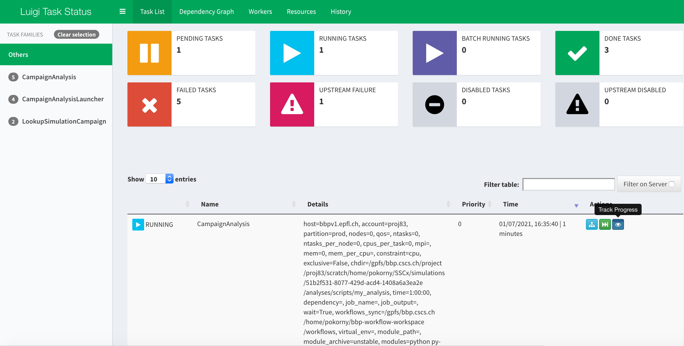

# BBP-workflow for launching simulation campaign analyses

Analysis script launcher using the [bbp-workflow](https://bbpteam.epfl.ch/project/spaces/display/BBPNSE/Workflow) framework to launch arbitrary analysis scripts on a simulation campaign that is registered in the [Nexus](https://bbp.epfl.ch/nexus/web/) knowledge graph.

ℹ️ Related ticket: [SSCXDIS-404](https://bbpteam.epfl.ch/project/issues/browse/SSCXDIS-404)

## Summary:
* All analyses to run need to be specified and parametrized in a launcher config file, e.g. <code>[campaign_analysis_launcher.cfg](workflows/campaign_analysis_launcher.cfg)</code>
* The simulation campaign needs to be specified by its Nexus URL
* All completed simulation paths are turned into a pandas.Series with a MultiIndex, where the index specifies simulation conditions and the values are paths to simulations. Optionally, a condition filter can be specified for each analysis to select only a subset of simulation conditions to apply the analysis to. The resulting data series is dumped as pickled file to <code>campaign_root/analyses/scripts/my_analysis/simulations.pkl</code>
* The latest version of each analysis script is cloned from a GIT repository to <code>campaign_root/analyses/scripts/my_analysis/my_analysis.py</code>
* Parameters as specified in the launcher config are extended with specification of where to put the output, by adding <code>{"output_root": "campaign_root/analyses/output/my_analysis"}</code>. Extended parameters are written to <code>campaign_root/analyses/scripts/my_analysis/parameters.json</code>
* Each analysis job is launched as separate SLURM job running <code>python -u my_analysis.py simulations.pkl parameters.json</code>
* The progress can be tracked using Luigi Task Visualizer, which can be accessed following the link retrieved by <code>bbp-workflow webui -o</code>
* All status/error messages of an analysis script are written to <code>campaign_root/analyses/scripts/my_analysis/slurm-xxx.out</code>

### Luigi Task Visualizer

### Output summary after successful completion of analysis job(s)
 finished")
    
## Analysis script specifications:
* First argument is the path to the DataFrame specifying the campaign simulations
* Second argument is the path to the file specifying the analysis parameters
* Output is to be written anywhere under the specified <code>"output_root"</code>

## Requirements:
* [bbp-workflow CLI](https://bbpteam.epfl.ch/project/spaces/pages/viewpage.action?spaceKey=BBPNSE&title=Workflow)

## How to run:
* <code>bbp-workflow launch-bb5 --follow campaign_analysis_launcher CampaignAnalysisLauncher</code>
